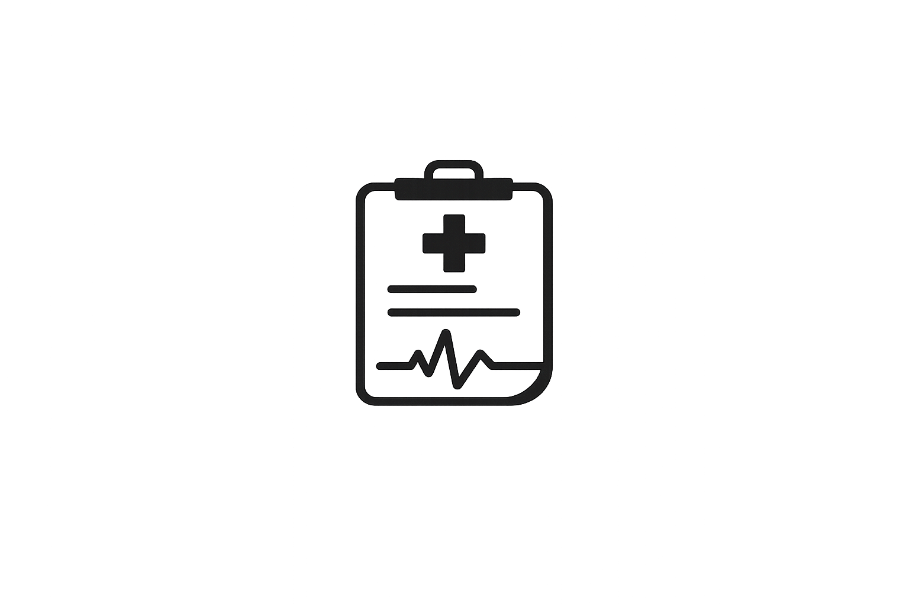

# ClinicScribe 🩺✍️

ClinicScribe is a small AI medical scribe app for clinic visits. It records a doctor-patient conversation, sends the audio for transcription, and turns the transcript into a structured clinical note with SOAP sections, a visit summary, extracted details, and patient-friendly discharge instructions.

It also keeps a lightweight patient dashboard so notes are not just floating around in a tab somewhere. Because we have all lost things to browser tabs. 😅



### **TEST IT HERE: https://clinicscribe.pages.dev/**

## What It Does ✨

- 🎙️ Records clinic audio in the browser
- 📝 Transcribes the recording through a transcription proxy
- 🧠 Generates structured clinical notes with AI
- 📋 Builds SOAP notes, summaries, red flags, follow-up plans, and discharge instructions
- 🌍 Translates notes into other languages
- 💬 Lets you chat with ClinicScribe AI to ask questions or request note edits
- 📌 Saves, pins, filters, and deletes patient encounters
- 🔄 Keeps signed-in dashboards fresh while you are on patient or dashboard pages
- 🧯 Checks audio size and file type before sending it to the transcription service (for security)
- 👤 Supports signed-in users through Supabase
- 🚪 Supports guest mode with local browser records and a short-lived server session

## Tech Stack 🛠️

- React 19
- TypeScript
- Vite
- Tailwind CSS
- Supabase Auth + Postgres
- Cloudflare Pages Functions
- Upstash Redis
- Featherless as the primary note-generation provider **[(Qwen/Qwen3-32B)](https://featherless.ai/models/Qwen/Qwen3-32B)**
- Ollama Cloud as the fallback provider **[(Qwen3.5:cloud)](https://ollama.com/library/qwen3.5)**

## Project Structure 🗂️

```text
ClinicScribe/
|-- functions/api/        # Cloudflare Pages API routes
|-- image/                # Source logo used in this README
|-- public/brand/         # App logos
|-- src/                  # React app and shared app logic
|-- src/server/           # Server-side note storage helpers
|-- src/utils/            # Supabase and dashboard helpers
|-- supabase/schema.sql   # Database tables, indexes, and RLS policies
`-- README.md
```

## Getting Started 🚀

First, install the dependencies:

```bash
npm install
```

Create your local environment files:

```bash
cp .env.example .env
cp .dev.vars.example .dev.vars
```

On PowerShell, the same thing is:

```powershell
Copy-Item .env.example .env
Copy-Item .dev.vars.example .dev.vars
```

Then run the frontend:

```bash
npm run dev
```

For the Cloudflare Pages Functions version, use:

```bash
npm run cf:dev
```

## Environment Variables 🔐

The browser app reads these from `.env`:

```env
VITE_SUPABASE_URL=your-supabase-project-url
VITE_SUPABASE_PUBLISHABLE_KEY=your-supabase-publishable-key
```

The Cloudflare Functions layer reads these from `.dev.vars` locally, or from your Cloudflare Pages project settings in production:

```env
SUPABASE_URL=your-supabase-project-url
SUPABASE_PUBLISHABLE_KEY=your-supabase-publishable-key

UPSTASH_DATABASE_URL=your-upstash-redis-rest-url
UPSTASH_DATABASE_KEY=your-upstash-redis-rest-token

PROXY_BASE_URL=your-transcription-proxy-url
TRANSCRIPTION_MODEL=gpt-4o-transcribe-diarize
PROXY_SHARED_SECRET=optional-shared-secret

FEATHERLESS_API_KEY=your-featherless-api-key
FEATHERLESS_BASE_URL=your-featherless-base-url
FEATHERLESS_MODEL=your-featherless-model

OLLAMA_API_KEY=your-ollama-api-key
OLLAMA_MODEL=your-ollama-model
```

The transcription endpoint currently accepts common browser audio formats like WebM, MP4, MP3/MPEG, OGG, and WAV. Audio files are capped at 25 MB so the app does not try to push giant recordings through the proxy and then quietly explode. Very rude when apps do that.

## Supabase Setup 🧱

ClinicScribe uses Supabase Auth for signed-in users and Supabase Postgres for patient profiles and encounter records.

1. Create a Supabase project.
2. Copy the project URL and publishable key into `.env` and `.dev.vars`.
3. Open the Supabase SQL editor.
4. Run the SQL in `supabase/schema.sql`.
5. Make sure email/password auth is enabled if you want normal sign-in.

The schema creates:

- `patients`
- `encounters`
- indexes for dashboard lookups
- row-level security policies so users only see their own records
- extra encounter checks so a saved visit has to belong to one of that user's patients

## Guest Mode 🚪

Guest mode is handy for demos or quick testing. Guest patient records live in that browser's `localStorage`, not in Supabase.

For API calls, guest mode also creates a server-backed guest session cookie. That gives the app a cleaner way to protect guest endpoints, rate-limit guest usage through Upstash, and avoid trusting a random header by itself.

If a guest later creates an account or signs in, ClinicScribe does a one-time sync from local guest records into the Supabase account, then clears the guest copy from local storage.

## Data Behavior 🧠

- Draft transcript autosave uses `sessionStorage`, so it is meant for the current browser session.
- Guest records use `localStorage`, so they stay in that browser until the guest clears them or syncs into an account.
- Signed-in patient and encounter records live in Supabase.
- The dashboard and patient pages quietly refresh saved records while the app is open, including when the tab gets focus again.
- Temporary note/audio data and guest session state use Upstash Redis behind the Cloudflare Functions layer.

## Useful Scripts 📦

```bash
npm run dev       # Start Vite
npm run build     # Type-check and build the app
npm run preview   # Preview the production build
npm run cf:dev    # Build, then run with Cloudflare Pages Functions locally
```

## A Quick Safety Note ⚠️

ClinicScribe is meant to help draft documentation, not replace clinical judgment. AI notes can miss context, misunderstand speech, or phrase something too confidently. Please review every generated note before using it in a real clinical workflow.

## Why This Exists 💭

Clinic visits move fast. Notes should not eat the whole day after the visit is already over. ClinicScribe is an attempt to make the boring admin part lighter while keeping the human part of care in front.

## License

Licensed under **PolyForm Noncommercial License 1.0.0**.

In simple terms, this is **similar** to **CC BY-NC 4.0**:

	Attribution: You must credit me.

	Non-Commercial: You cannot sell this or use it for business.

See [LICENSE](LICENSE) for the full legal text.

Commercial use is not permitted under this license.
